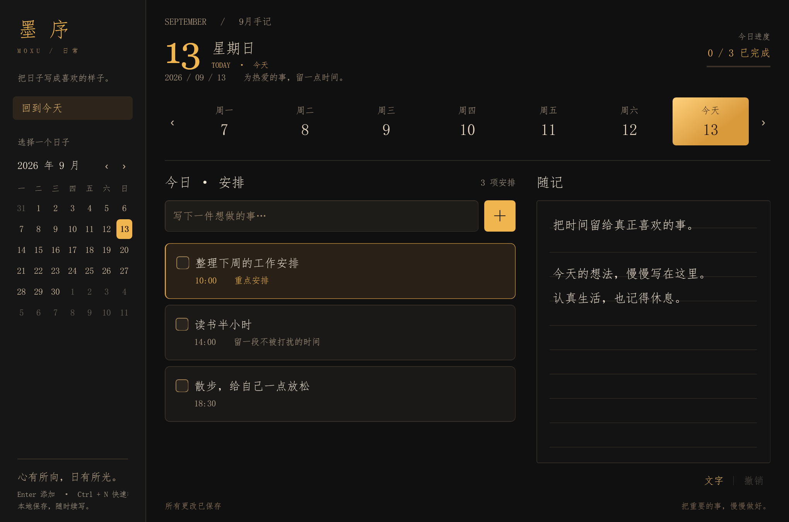

# 知微墨序 · Zhiwei Moxu

账本、日程与随记的个人应用项目，包含云端网站演示版和原有 Windows 桌面版。

**在线网站：[https://zhiweimoxu.cn](https://zhiweimoxu.cn)**  
网站为单账号演示，访问密码请向作者获取，不在仓库公开。所有使用该账号的人共享同一份数据。

## 先看哪里

| 入口 | 内容 |
|---|---|
| [Web 版说明](web/README.md) | 功能、技术栈、架构、接口、本地启动、测试和当前限制 |
| [Web 源码](web/) | 已部署演示版的前端与 Node.js 后端 |
| [部署与维护](web/docs/DEPLOYMENT.md) | Ubuntu、Nginx、systemd、HTTPS、备份与故障定位 |
| 下方 Windows 说明 | 原有桌面程序下载、构建和本地数据管理 |

## Web 版技术栈

| 部分 | 技术 |
|---|---|
| 前端 | HTML、CSS、原生 JavaScript |
| 后端 | Node.js 内置 HTTP 模块，无 Express |
| 数据 | JSON 文件，未使用数据库 |
| 部署 | 腾讯云香港轻量服务器、Ubuntu 24.04 LTS |
| 网站入口 | Nginx 反向代理 |
| HTTPS | Let's Encrypt、Certbot |
| 后台运行 | systemd |
| 测试 | Node.js 内置测试运行器 |

当前实现了密码登录、会话校验、账本与计划日记保存、保存冲突检测和最近 30 份文件备份。它是小型单账号演示，尚未实现多人注册、独立用户数据、数据库或分布式部署。

## 本地运行 Web 版

先安装 Node.js（推荐 24），克隆或下载本仓库后执行：

```bash
cd web
node setup.cjs
node server.cjs
```

保存初始化时显示的随机密码，打开 http://127.0.0.1:18765 登录。测试命令为 `node --test test.cjs`，当前本地和 Ubuntu 服务器验收均通过 2 组测试。仓库不包含网站密码、服务器凭据、个人账本或日记。

## 开发过程说明

项目使用 AI 辅助开发、测试设计和排错，作者参与需求与交互选择，并完成服务器购买、环境安装、命令执行、文件上传、域名解析、HTTPS 配置和实际体验验收。项目展示当前可运行的实现与学习过程，不宣称全部代码由人工独立编写，也不将演示版等同于生产级多用户系统。

代码上传 GitHub 用于阅读和版本管理；网站实际运行在腾讯云，仓库推送不会自动部署到服务器。

---

# 墨序 · Moxu

深黑与暖金配色的 Windows 每日规划软件。用仿宋写下安排，在横线随记页记录生活。



## 使用

下载整个仓库的 ZIP，解压到可写文件夹（例如 D 盘），双击 `portable/Moxu.exe`。
也可以在该文件页面点击下载原始文件。无需账号、联网或安装向导。

- 点日历或周视图，切换今天、未来或过去的日期。
- 输入安排，按 Enter 或点加号添加。
- 点击任务文字，展开修改标题、时间、重点和备注。
- 勾选完成；删除后可以撤销删除。
- 在右侧「随记」的横线页写文字，每个日期单独保存。
- 输入后约半秒自动保存；Ctrl + S 立即保存；Ctrl + N 聚焦添加框。
- 再次双击程序会请求唤回已经打开的窗口。

## 数据

运行后，在可执行文件旁创建 `Data` 文件夹：

- `plans.json`：计划和日记。
- `plans.json.bak`：上一次保存的备份。
- `session.lock`：运行时占用锁。

备份时先关闭软件，再复制整个 `Data` 文件夹。请勿仅移动程序而遗漏数据。
这些文件已加入 Git 忽略规则。仓库不包含个人安排、日记、账号或密钥；界面截图使用示例内容。

## 环境与字体

Windows 10/11，.NET Framework 4.x，WPF。程序使用系统字体，不捆绑字体文件。
默认字体为系统仿宋；安装有可识别的方正仿宋时，正文会优先使用它。

## 从源码构建

在 Windows PowerShell 中，从仓库根目录运行：

```powershell
powershell.exe -NoProfile -ExecutionPolicy Bypass -File .\build.ps1
```

生成 `build/Moxu.exe`。构建使用 Windows 自带的 .NET Framework C# 编译器，不需要下载 npm 包。

图标由 `make-icon.ps1` 绘制，修改后先运行该脚本，再重新构建。

## 检查

程序包含独立的 `--test` 模式，覆盖中文和多行文本保存、跨年日期、完成状态、备份恢复、界面添加与编辑、日期切换、删除撤销和重新读取。测试目录必须使用新的空目录。

```powershell
$testDir = Join-Path $env:TEMP ('moxu-test-' + [Guid]::NewGuid().ToString('N'))
$p = Start-Process .\build\Moxu.exe -ArgumentList @('--test', ('"' + $testDir + '"')) -PassThru -Wait
$p.ExitCode
Get-Content (Join-Path $testDir 'passed.txt')
```

## 当前范围

这是个人桌面软件的早期版本，数据仅保存在本机。随记支持文字，不提供绘画或云同步。程序尚未进行代码签名。

