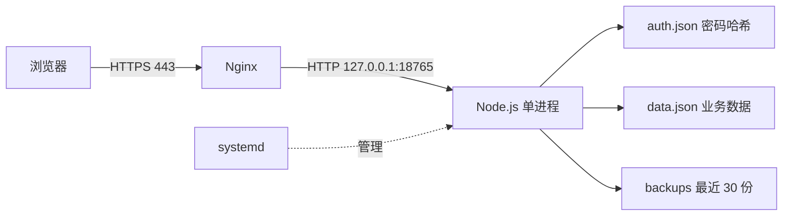

# 知微墨序 · Web 演示版

把账本、每日安排和随记放在同一个个人空间里的网页应用。延续墨序的深黑与暖金配色，将本地使用方式扩展到浏览器，并完成云服务器部署。

**在线演示：[https://zhiweimoxu.cn](https://zhiweimoxu.cn)**。访问密码由项目作者单独提供，不在仓库公开。当前是共享单账号，所有获准访问的人看到并修改同一份演示数据。

本项目定位为个人学习与实战展示，开发、排错和部署使用了 AI 辅助。当前版本体现的是从页面交互、简单后端到云部署的完整实践，尚不是面向公众注册的成熟产品。

## 功能

- 账本：六个可改名的账户、收入支出、转账、余额校准、基金手动估值、月度统计。
- 计划：目标记录、习惯打卡、每日安排、完成状态、日期切换。
- 随记：按日期保存文字，自动保存与浏览器本地草稿。
- 数据管理：JSON 导入导出、服务端校验、保存冲突提示、自动保留最近 30 份保存前备份。
- 访问控制：密码登录、会话过期、退出登录，未登录无法读取或修改账本。

首次运行使用零余额和空白安排、日记；源码不包含个人账本数据。

## 技术栈

| 层次 | 实际使用 | 职责 |
|---|---|---|
| 前端 | HTML、CSS、原生 JavaScript | 页面渲染、交互、表单校验、Fetch 请求 |
| 后端 | Node.js 内置 `http`、`fs`、`crypto` | 路由、会话、密码校验、数据读写 |
| 数据存储 | JSON 文件 | 单账号账本、安排、日记；没有接入数据库 |
| 部署环境 | 腾讯云香港轻量应用服务器、Ubuntu 24.04 LTS | 云端持续运行 |
| 反向代理 | Nginx | 接收域名访问，转发至本机 Node.js 端口 |
| 加密访问 | Let's Encrypt、Certbot | HTTPS 证书与自动续期 |
| 进程管理 | systemd | 非 root 用户运行、开机启动、失败后重启 |
| 自动测试 | `node:test`、`assert`、VM 脚本检查 | 接口、持久化与页面脚本验证 |

没有使用 React、Vue、Express、MySQL 或云数据库；运行与测试没有第三方 npm 依赖。开发和服务器验收使用 Node.js 24，项目声明最低版本为 Node.js 22。

## 运行关系



域名通过 DNS A 记录指向服务器。GitHub 保存源码；在线网站运行在腾讯云，不是 GitHub Pages，也没有配置推送代码后自动部署。

## 本地启动

安装受支持的 Node.js（推荐 24），从仓库根目录执行：

```bash
cd web
node setup.cjs
node server.cjs
```

第一次初始化会在终端显示随机生成的访问密码，请保存。打开 [http://127.0.0.1:18765](http://127.0.0.1:18765) 登录。保持该终端运行；`Ctrl+C` 停止服务。再次启动只需要 `node server.cjs`，不要重复初始化。

Windows 也可以双击 `启动演示.cmd`：它会初始化并在后台启动服务、打开浏览器，首次密码保存在 `private/首次登录.txt` 并用记事本显示。该文件是本机明文辅助文件，应妥善保管；它与整个 `private/` 目录均不上传 GitHub。

默认地址是 `127.0.0.1`，请使用上面的完整地址；Host 校验不允许随意改成其他域名访问。

## 配置

| 环境变量 | 默认值 | 说明 |
|---|---|---|
| `PORT` | `18765` | Node.js 监听端口 |
| `HOST` | `127.0.0.1` | 默认只接收本机请求，由 Nginx 对外提供服务 |
| `APP_ORIGIN` | `http://127.0.0.1:18765` | 完整网站来源，生产示例 `https://example.com`；不要带路径 |
| `DATA_DIR` | `web/private` | 密码配置、业务数据及备份的目录 |
| `NODE_ENV` | 未设置 | 服务器设为 `production`，该模式要求 HTTPS 来源 |

程序不自动加载 `.env` 文件；请通过系统环境或 systemd 的 `Environment=` 配置变量。

## 接口与实现

| 请求 | 用途 | 校验 |
|---|---|---|
| `GET /login` | 登录页面 | 公开 |
| `POST /login` | 密码登录 | Origin、密码、失败限速 |
| `GET /` | 主页面 | 有效会话；未登录跳转到登录页 |
| `GET /api` | 读取当前完整数据 | 会话、`x-token`，返回 `ETag` |
| `POST /api` | 提交完整数据 | 会话、Origin、`x-token`、`If-Match`、业务数据校验 |
| `POST /logout` | 注销当前会话 | 会话、Origin、`x-token` |
| `GET /health` | 简单存活检查 | Host 校验，返回 `{"ok":true}`；不是完整健康诊断 |

- **密码与会话**：密码使用随机盐与 scrypt 哈希，比较时使用 `timingSafeEqual`。Cookie 使用 `HttpOnly`、`SameSite=Strict`，HTTPS 来源下启用 `Secure`。会话保存在内存，8 小时过期，服务重启后重新登录。
- **请求校验**：POST 检查来源，业务接口还检查会话令牌。静态资源使用固定白名单，不会把数据目录作为网站公开。
- **保存冲突**：后端对当前数据计算 ETag，写入必须携带匹配的 `If-Match`；旧版本写入返回 409。此方案面向单 Node.js 进程，不是数据库事务或分布式锁。
- **持久化**：校验后写临时文件，再通过 rename 替换数据文件；每次保存前备份旧文件，保留最近 30 份。备份在同一磁盘，不能替代异地备份或灾难恢复。
- **限流**：同一连接来源 15 分钟内最多 10 次登录尝试，成功后清零。当前不信任 `X-Forwarded-For`，经过本机 Nginx 时会共享来源限额。

## 测试

在 `web/` 下运行：

```bash
node --test test.cjs
```

两组自动测试包含：

1. 在简化 DOM 环境中加载网页脚本，检查六个页面的渲染逻辑和空白种子数据。
2. 启动真实 HTTP 子进程，验证登录、Cookie 标记、未授权访问、Origin 与令牌校验、非法数据拒绝、版本冲突、备份内容、重启持久化、注销与登录限速。

测试使用系统临时目录和随机测试密码，不读取在线数据。当前已在本地 Node.js 24 和 Ubuntu 服务器上通过（2 组通过、0 失败）。页面脚本测试不是完整浏览器自动化测试；移动端体验、实际交互和公网连通性仍需人工验收。

## 部署与维护

详见 [Ubuntu 部署与维护指南](docs/DEPLOYMENT.md)。`deploy/` 中提供 systemd 和 Nginx 模板，域名使用 `example.com` 占位，部署前替换为自己的域名。

```text
web/
├── public/          页面、登录脚本、图标
├── server.cjs       HTTP 服务、登录会话、接口与文件保存
├── validation.cjs   业务数据校验
├── setup.cjs        首次密码初始化
├── launch.cjs       Windows 本地后台启动辅助
├── test.cjs         自动测试
├── deploy/          Nginx / systemd 模板
├── docs/            部署与维护说明
└── private/         运行时生成，不提交仓库
```

## 当前限制与后续方向

- 只有一个共享账号，没有注册、角色权限、多用户数据隔离或密码自助找回。
- JSON 全量读写，写盘使用同步操作，API 请求体上限 2 MiB；适合小型演示，不适合大量用户、大数据集或多实例部署。
- 会话与登录限速在内存中，重启会丢失；没有 Redis、审计日志、邮件告警和完整监控。
- 前端部分脚本与样式内嵌，CSP 目前允许 `unsafe-inline`，未做完整安全审计或性能压测。
- 浏览器会保存随记草稿。共享设备上应完成保存并退出登录；不要在公开演示账号中填写真实隐私资料。
- 下一步优先考虑拆分前端模块、统一前后端校验、迁移 SQLite/PostgreSQL、增加多用户权限和异地备份，再补充浏览器端到端测试。

## 开发说明

AI 辅助参与了代码生成、修改、测试设计和部署指导；项目作者完成了需求选择、腾讯云资源配置、命令执行、域名解析、HTTPS 配置与实际体验验收。该仓库用于展示当前实现和学习过程，不代表所有代码均由人工独立编写，也不代表已经具备生产级后端能力。
